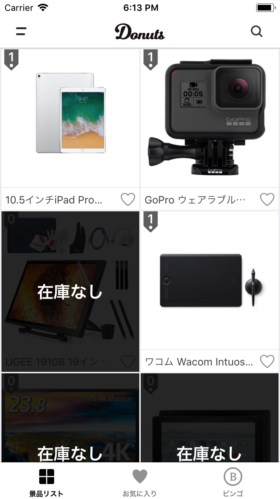
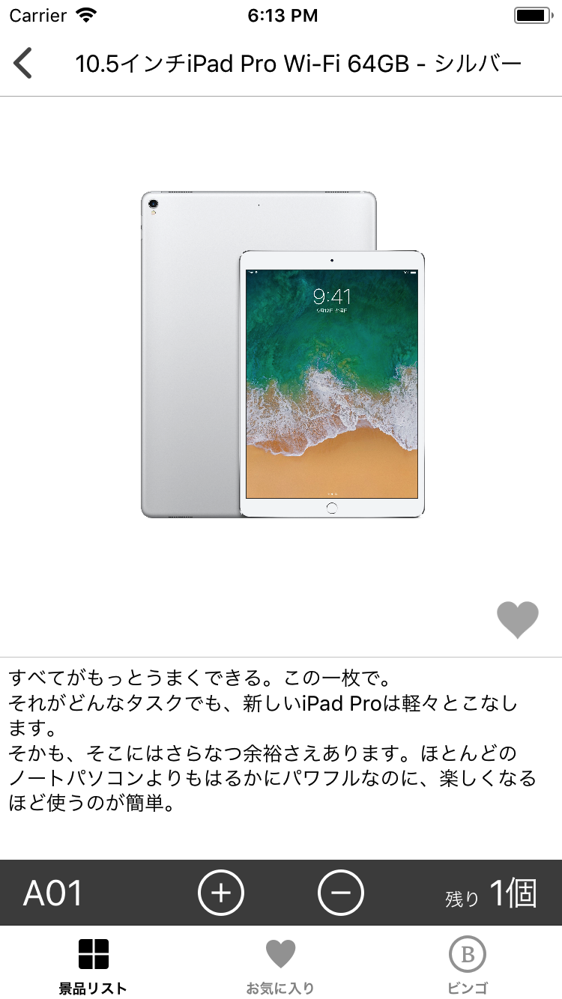

# DonutsNewYear
忘年会景品管理アプリです

### Setup project
Go to the root directory of the project and run
```
pod install
```
### Setup config file
Download the GoogleService-Info.plist from the Firebase console and import the file to the project.

### Setup initial data
Go to the Firebase realtime database console and import the sample.json to the database


### ScreenShot


